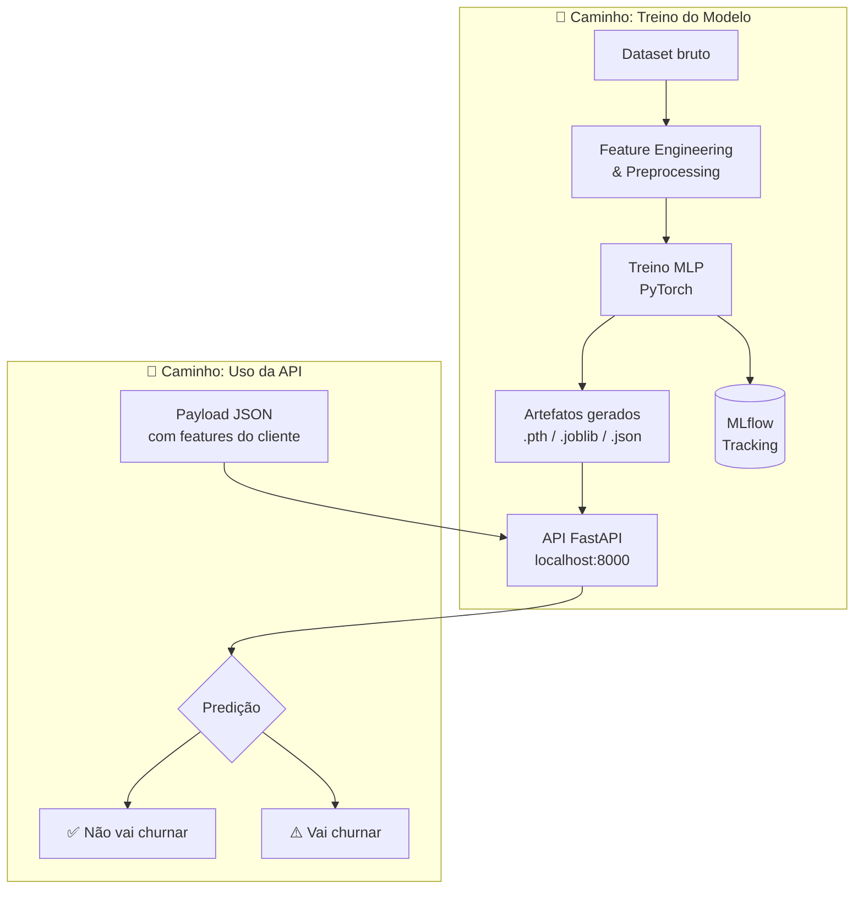

# ML Churn Prediction

Projeto desenvolvido para o Tech Challenge 1 do curso de Machine Learning Engineering da FIAP focado na construção de um serviço end-to-end para previsão de churn usando uma MLP em Pytorch, sendo essa solução provisionada via API em FastAPI, com monitoramento de métricas e artefatos via MLFlow.

Para um resumo rápido, também temos um [🎥Vídeo Explicativo em menos de 5 min](https://youtu.be/gOmqwpTSEcQ)

---


## 👥 Integrantes
| Nome | RM | Contato |
|--|--|--|
| Gabriel de Paula Vicente | RM373848 | [Github](https://github.com/gabrielpvicente) - [Linkedin](https://www.linkedin.com/in/gabriel-de-paula-vicente-796198102/)|
| Gustavo Dell Anhol Oliveira | RM372138 | [Github](https://github.com/gudaoliveira) - [Linkedin](https://www.linkedin.com/in/gustavodell/)|
| Kevin Pagrion Bela | RM371774 | [Github](https://github.com/kevinpabe) - [Linkedin](https://www.linkedin.com/in/kevinpb/)|
| Patrick Kwan | RM373172 | [Github](https://github.com/ptkwan) - [Linkedin](https://www.linkedin.com/in/patrick-kwan-617296220/)|
| Vitor Akira Ucha Ito | RM371483 | [Github](https://github.com/VitorAkira-me) - [Linkedin](https://www.linkedin.com/in/vitor-akira/)|

## 📋 Requisitos

- Python 3.12
- `uv` instalado para gerenciamento das dependencias

## ⚙️ Setup
Realize o clone do repositório com

```bash
git clone https://github.com/fiap-postech-ml-engineering/ml-churn-prediction

cd ml-churn-prediction
```
Crie o ambiente virtual
```bash
uv venv
```
Para acessar o ambiente virtual

```bash
Windows 		-> .venv\Scripts\activate
Linux / macOS 	-> source .venv/bin/activate
```
Instale as dependências com 
```
uv sync
```
Ou se quiser as dependencias de desenvolvimento (incluindo testes, lint e formatação):
```bash
uv pip install -e .[dev]
```

# Visão geral do projeto

Serviço end-to-end de previsão de churn com MLP em PyTorch, exposto via API REST (FastAPI) e com experimentos rastreados no MLflow. O pipeline cobre desde o pré-processamento até a inferência em produção.

## 📁 Estrutura de pastas

- `docs/`: Model Card, plano de monitoramento e demais documentos finais
- `notebooks/`: Exploração e validação histórica do projeto
- `src/`: Código-fonte do pipeline, treino, inferência e API
- `data/`: Dataset bruto original
- `models/`: Pesos, pipeline e artefatos versionados
- `tests/`: Testes automatizados
- `logs`: Logs e saídas das execuções

## 📚 Documentações importantes
- [ML Canvas](docs/ml_canvas.md) — visão de negócio, métricas, objetivos e plano de ação a partir do modelo
- [Model Card](docs/model_card.md) — detalhes técnicos do modelo, métricas, arquitetura e limitações
- [Arquitetura de Deploy](docs/deploy_architecture.md) — detalhes da implementação da API, configuração e limitações atuais
- [Plano de Monitoramento](docs/monitoring_plan.md) — métricas, alertas e playbook para monitoramento em produção

## 🔄 Fluxo do projeto



## 🚀 Execução e Automação

O projeto está automatizado com `Makefile` (use `make help` para mais detalhes) e `Taskipy`, com a única diferença entre eles sendo o comando `init` e `stop` que inicia a API e o MLFlow em segundo plano nas portas 8000 e 8001 respectivamente:

```bash
make init
# ...
API em background na porta 8000 <localhost:8000> (PID xxxxxxxx)
MLflow em background na porta 8001 <localhost:8001> (PID xxxxxxxx)
```

```bash
make stop
# ...
Serviços finalizados
```

Caso não tenha acesso ao `make` no seu terminal você pode subir a API com 

```bash
uvicorn main:app --reload --host 0.0.0.0 --port 8000
```
_vide [Arquitetura de Deploy](docs/deploy_architecture.md) para detalhamento dos endpoints_


e subir o MLFLow com o comando
```bash
mlflow ui --backend-store-uri ./mlruns --port 8001
```
## 🧪 Treinar novamente o modelo

O treino reprodutível fora do notebook consome o dado bruto, aplica o mesmo no pipeline sklearn e regenera os artefatos após o treinamento.
- O script de treino é o `src/training/train_mlp.py`, nele temos um fallback para, caso o modelo não encontre o pipeline serializado, gere o mesmo através do `src/training/build_pipeline.py`

```bash
python -m src.training.train_mlp
```

Artefatos gerados:

- `models/preprocessing/churn_tabular_preprocessing_pipeline_v1.joblib`
- `models/mlp/churn_mlp_best_state_dict_v1.pth`
- `models/mlp/churn_mlp_input_features_v1.joblib`
- `models/mlp/churn_mlp_input_scaler_v1.joblib`
- `models/mlp/churn_mlp_metrics_v1.json`

## ✅ Testes e validação

O projeto mantém testes de API, schema, smoke e paridade offline vs API. Para rodar:

```bash
make test
```

Ou diretamente com pytest:

```bash
pytest tests/ -v
```

## 🔮 Como reproduzir uma inferência

Envie um `POST` para `http://localhost:8000/predict` com o payload abaixo:

**Exemplo de payload (Churner):**

```json
{
	"features": {
		"Latitude": 34.425581,
		"Longitude": -119.813765,
		"Gender": "Female",
		"Senior Citizen": "No",
		"Partner": "Yes",
		"Dependents": "No",
		"Tenure Months": 12,
		"Phone Service": "Yes",
		"Multiple Lines": "No",
		"Internet Service": "Fiber optic",
		"Online Security": "Yes",
		"Online Backup": "No",
		"Device Protection": "Yes",
		"Tech Support": "No",
		"Streaming TV": "Yes",
		"Streaming Movies": "No",
		"Contract": "Month-to-month",
		"Paperless Billing": "Yes",
		"Payment Method": "Credit card (automatic)",
		"Monthly Charges": 79.65,
		"Total Charges": 95.4,
		"CLTV": 5432,
	}
}
```

**Exemplo de payload (Não Churner):**
```json
{
	"features": {
		"Latitude": 34.027337,
		"Longitude": -118.285150,
		"Gender": "Male",
		"Senior Citizen": "No",
		"Partner": "Yes",
		"Dependents": "Yes",
		"Tenure Months": 0,
		"Phone Service": "Yes",
		"Multiple Lines": "Yes",
		"Internet Service": "Fiber optic",
		"Online Security": "Yes",
		"Online Backup": "Yes",
		"Device Protection": "Yes",
		"Tech Support": "Yes",
		"Streaming TV": "Yes",
		"Streaming Movies": "Yes",
		"Contract": "One year",
		"Paperless Billing": "Yes",
		"Payment Method": "Electronic check",
		"Monthly Charges": 105.5,
		"Total Charges": 2686.05,
		"CLTV": 5822,
	}
}
```

## 📊 Tracking com o MLflow

Para visualizar os experimentos use:
```
make init
```
Ou simplesmente
```
mlflow ui --backend-store-uri ./mlruns --port 8001
```

Decidimos manter o MLFlow localmente para esse projeto, utilizando a estrutura de diretórios, que foi a configuração que melhor se encaixou no nosso fluxo de trabalho. Nele encontramos atualmente 4 experimentos
- **notebook_training_baselines**: Runs onde testamos diferentes modelos afim de definir o nosso baseline inicial
- **notebook_training_cross_validation**: Runs onde testamos diferentes hiperparâmetros e validamos o desempenho do modelo baseline, definindo no final o melhor threshold de predição
- **notebook_training_mlp**: Runs onde armazenamos o treino do modelo de MLP e as subruns para a definição do melhor threshold
- **ml-churn-prediction**: Aqui é onde executamos os runs dos treinos em "produção" (fora dos notebooks)

## 🔧 Pontos de melhoria

Durante o desenvolvimento do projeto, algumas decisões foram tomadas visando a entrega dentro do prazo, mas que poderiam ser melhoradas com mais tempo, como por exemplo:

- O modelo MLP é relativamente simples e poderia ser aprimorado com técnicas de regularização, arquitetura mais complexa ou até mesmo experimentação com outros tipos de modelos.
- O MLFlow só existe localmente, o que poderia ser melhorado com uma configuração de MLFlow Server, permitindo o acesso remoto e colaboração entre equipes.
- A API é funcional, mas poderia ser aprimorada com autenticação, versionamento de modelos e uma camada de cache para melhorar a performance em predições frequentes.
- Não foi implementado um pipeline de CI/CD, o que poderia automatizar testes, linting e deploy para ambientes de staging ou produção.
